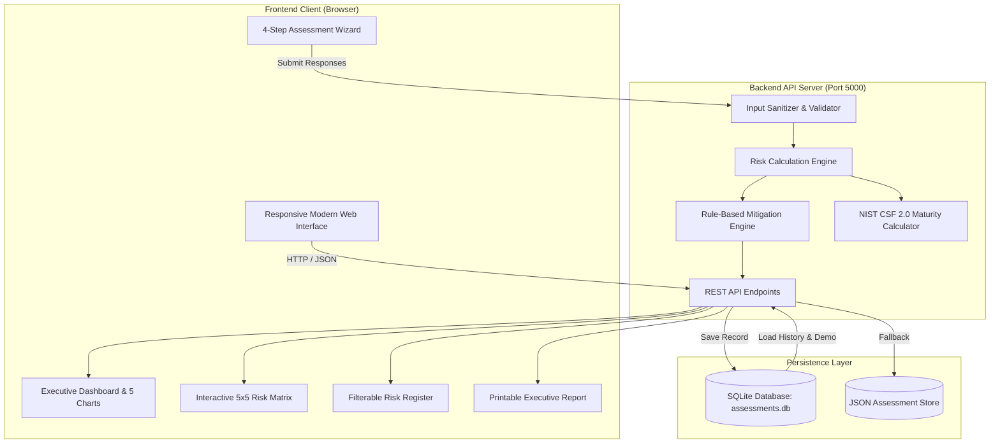

This Project is Basically  For cybersecurity Risk Assessment For Small Businesses And To Prevent Their Data 
[README.md](https://github.com/user-attachments/files/32696512/README.md
# Cybersecurity Risk Assessment Framework for Small Businesses (SMEs)

[](LICENSE)
[](https://www.nist.gov/cyberframework)
[](https://www.python.org/)
[](https://nodejs.org/)
[-brightgreen.svg)]()

---

## 📌 Abstract
Small and Medium Enterprises (SMEs) constitute over 90% of businesses worldwide and represent the backbone of the global digital economy. However, SMEs increasingly suffer targeted cyber attacks—with research indicating that **43% of cyber breaches target small businesses**, and **60% of victimized SMEs permanently shut down within six months** due to financial and reputational devastation. 

Existing enterprise risk assessment tools (such as FAIR, OCTAVE, and ISO 27005 frameworks) are prohibitively complex, resource-intensive, and cost-prohibitive for SMEs that lack dedicated Security Operations Centers (SOCs) or Chief Information Security Officers (CISOs).

This project implements the **Cybersecurity Risk Assessment Framework for Small Businesses**, a web-based, quantitative decision-support application aligned with the **NIST Cybersecurity Framework (CSF 2.0)**. It enables SME executives and IT managers to evaluate organizational exposure against 10 critical cyber threats, audit 10 baseline security controls, visualize threat distribution on an interactive 5×5 risk matrix, inspect a filterable Risk Register, and generate a prioritized, rule-based mitigation action plan with automated executive PDF/Print report generation.

---

## 🎯 Problem Statement
1. **Disproportionate SME Attack Exposure**: Cybercriminals exploit small businesses as low-hanging entry points into larger enterprise supply chains.
2. **Resource & Expertise Deficit**: Most SMEs lack dedicated security engineers to interpret complex compliance checklists.
3. **Lack of Transparent Scoring**: Qualitative labels ("High", "Medium", "Low") in informal audits lack mathematical rigor and fail to justify cybersecurity budget allocations to executive leadership.
4. **Absence of Actionable Roadmaps**: Typical security audits identify vulnerabilities without providing cost-effective, prioritized remediation guidance.

---

## 🏆 Project Objectives
1. **Research & Modeling**: Model cybersecurity risks confronting modern SMEs operating hybrid and cloud infrastructures.
2. **Identification of Core Threats**: Systematically assess the 10 most pervasive SME cyber threats:
   - Phishing
   - Ransomware
   - Malware
   - Insider Threat
   - Data Breach
   - Weak Passwords
   - Distributed Denial of Service (DDoS)
   - Unpatched Software
   - Social Engineering
   - Unauthorized Access (Open RDP / Lateral Movement)
3. **Quantitative Metric**: Implement a mathematically transparent 3-dimensional risk evaluation formula:
   $$\text{Risk Score} = \text{Likelihood} \times \text{Severity} \times \text{Business Impact} \quad (\text{Max Score} = 125)$$
4. **NIST CSF 2.0 Mapping**: Align assessment questions, control deficiencies, and mitigation plans with the 5 core functions:
   - **Identify (ID)**
   - **Protect (PR)**
   - **Detect (DE)**
   - **Respond (RS)**
   - **Recover (RC)**
5. **Interactive Dashboard & Matrix**: Deliver interactive 5×5 risk matrices, Chart.js analytics, and a searchable Risk Register.
6. **Prioritized Mitigation Engine**: Automatically generate actionable recommendations structured from Priority 1 (Immediate / Critical) to Priority 5 (Proactive Maintenance).
7. **Demonstration & Persistence**: Provide a persistent SQLite storage backend and a one-click realistic case study (**TechNova Solutions** demo).

---

## 💻 Technology Stack

| Layer | Technologies Used | Rationale |
|---|---|---|
| **Frontend** | HTML5, Modern Vanilla CSS3, Vanilla JavaScript (ES6+) | Blazing-fast performance, zero frontend build overhead, responsive across mobile and desktop. |
| **Data Visualization** | Chart.js 4.x (via CDN & Local Canvas Fallback) | Interactive Doughnut, Horizontal Bar, Bubble/Scatter, and NIST Radar charts. |
| **Backend API** | Python 3.x Standard Library (`http.server`, `sqlite3`, `json`) & Node.js Express | Dual-compatible server architecture; runs immediately on any Python or Node.js environment without external dependency friction. |
| **Database** | SQLite 3 / JSON Document Store | Serverless, zero-configuration ACID-compliant local relational persistence. |
| **Testing** | Python `unittest` & Node.js native test runner | Comprehensive automated test coverage for risk math, edge cases (1,1,1 to 5,5,5), and NIST maturity tiers. |

---

## 🏛 System Architecture



---

## 📐 Mathematical Risk Scoring Model

### 1. Single Threat Risk Formula
$$\text{Threat Risk Score} = \text{Likelihood} \times \text{Severity} \times \text{Business Impact}$$

Where:
- $\text{Likelihood} \in [1, 5]$ (1 = Rare, 2 = Unlikely, 3 = Moderate, 4 = Likely, 5 = Almost Certain)
- $\text{Severity} \in [1, 5]$ (1 = Negligible, 2 = Minor, 3 = Moderate, 4 = Major, 5 = Catastrophic)
- $\text{Business Impact} \in [1, 5]$ (1 = Negligible, 2 = Minor, 3 = Moderate, 4 = Significant, 5 = Severe Operational Disruption)

**Minimum Score**: $1 \times 1 \times 1 = 1$  
**Maximum Score**: $5 \times 5 \times 5 = 125$

### 2. Five-Tier Risk Level Classification
| Score Range | Classification | Color Code | Action Required |
|---|---|---|---|
| **0 – 25** | Low | `#10b981` (Green) | Accept risk / Routine maintenance |
| **26 – 50** | Moderate | `#f59e0b` (Amber) | Implement baseline defensive controls |
| **51 – 75** | High | `#f97316` (Orange) | Actively plan mitigation within 30 days |
| **76 – 100** | Very High | `#ef4444` (Red-Orange) | Urgent management intervention within 14 days |
| **101 – 125** | Critical | `#dc2626` (Crimson) | Immediate emergency response (within 48 hours) |

### 3. Overall Organization Risk Score
$$\text{Overall Risk Score} = \frac{1}{N} \sum_{k=1}^{N} \text{Threat Score}_k \quad (\text{where } N = 10)$$

### 4. Security Control Posture Score
$$\text{Security Posture Score} = \left( \frac{\sum \text{Implemented Controls}}{\text{Total Controls (10)}} \right) \times 100\%$$

| Posture Percentage | Tier Designation | Organizational Posture |
|---|---|---|
| **80% – 100%** | Tier 4 (Adaptive) | Strong |
| **60% – 79%** | Tier 3 (Repeatable) | Good |
| **40% – 59%** | Tier 2 (Risk-Informed) | Needs Improvement |
| **20% – 39%** | Tier 1 (Partial) | Weak |
| **0% – 19%** | Tier 0 (Deficient) | Critical Exposure |

---

## 🛡️ NIST CSF 2.0 Mapping Matrix

| NIST Function | Function Goal | Mapped Controls | Mapped Threat Vectors |
|---|---|---|---|
| **IDENTIFY (ID)** | Asset understanding, data classification, governance | Access Control / RBAC, Asset Inventory | Insider Threat, Data Breach |
| **PROTECT (PR)** | Identity safeguards, training, device protection | Firewall, EDR, MFA, Encryption, Training, Patching | Phishing, Ransomware, Malware, Weak Passwords, Unpatched Software, Unauthorized Access, Social Engineering |
| **DETECT (DE)** | Continuous telemetry and anomaly identification | Security Event Monitoring & Centralized Logging | Shadow IT, Credential Stuffing, Lateral Movement |
| **RESPOND (RS)** | Incident containment, forensics, communication | Incident Response & Disaster Recovery Plan | DDoS Attacks, Active Malware Outbreaks |
| **RECOVER (RC)** | Business continuity and system restoration | Regular & Immutable 3-2-1 Backups | Ransomware Outbreaks, Physical Loss |

---

## 🚀 Installation & Local Execution

### Prerequisites
- Python 3.8+ (Already installed on your system!) OR Node.js 16+
- Modern Web Browser (Chrome, Firefox, Edge, Safari)

### Option A: Run with Python (Recommended & Zero Configuration)
No `pip install` or external build tools required!

```bash
# 1. Clone or navigate to the project directory
cd C:\Users\Administrator\.gemini\antigravity-ide\scratch\cybersecurity-risk-framework

# 2. Run the automated test suite
python tests/test_risk_engine.py

# 3. Start the application server
python backend/server.py 5000
```
Open your browser and navigate to: **`http://localhost:5000`**

---

### Option B: Run with Node.js
```bash
# 1. Install dependencies
npm install

# 2. Run automated tests
npm test

# 3. Start the Express server
npm start
```
Navigate to: **`http://localhost:5000`**

---

### Option C: Standalone Static Usage (No Server Needed)
Simply double-click `frontend/index.html` in Windows Explorer or open it in any web browser. The application includes a self-contained local calculation engine that provides 100% of all assessment, matrix, chart, and report features completely offline!

---

## 🧪 Automated Testing

The automated test suite verifies:
1. Single threat calculation formula: $\text{Likelihood} \times \text{Severity} \times \text{Impact}$.
2. Edge cases:
   - Lowest boundary: $(1, 1, 1) = 1$
   - Highest boundary: $(5, 5, 5) = 125$
   - Input clamping for out-of-bounds inputs.
3. Classification boundary transitions (0, 25, 26, 50, 51, 75, 76, 100, 101, 125).
4. Security posture scoring and classification.
5. NIST CSF 5-function maturity mapping.
6. Mitigation engine prioritization (Priority 1 through Priority 5 sorting).
7. Non-guarantee legal disclaimer presence.

Run the test suite with:
```bash
python tests/test_risk_engine.py
```

Expected output:
```
============================================================
 RUNNING AUTOMATED UNIT & INTEGRATION TESTS (PYTHON)
 Cybersecurity Risk Assessment Framework for Small Businesses
============================================================

test_full_assessment_pipeline_demo_data ... ok
test_risk_classification_boundaries ... ok
test_security_posture_scoring ... ok
test_single_threat_edge_cases ... ok

----------------------------------------------------------------------
Ran 4 tests in 0.001s

OK
```

---

## 💼 Case Study: TechNova Solutions (Demo Data)

The application includes an integrated case study for **TechNova Solutions**:
- **Industry**: IT Services
- **Employees**: 50
- **Devices**: 75
- **Locations**: 2
- **Cloud Infrastructure**: AWS & Microsoft 365
- **Customer Data**: Stores client databases and PII
- **Security Deficiencies**: Missing Multi-Factor Authentication (MFA), unencrypted laptops, lack of staff awareness drills, missing centralized log monitoring, and no written Incident Response Plan.
- **Results**:
  - Overall Risk Score: **53.5 / 125 (High Risk)**
  - Security Posture: **50.0% (Needs Improvement)**
  - Critical/High Threats: Unauthorized Access (80), Data Breach (80), Ransomware (75), Phishing (64), Weak Passwords (64), Social Engineering (64).

Click **"⚡ Load Demo"** in the top navigation bar to instantly populate and explore this case study.

---

## 📸 Screenshots & Interface Walkthrough

1. **Cybersecurity Landing Page**: Dark theme with cyan/emerald glowing accents, NIST CSF overview, threat profiles, and live statistics.
2. **4-Step Assessment Wizard**: Step 1 (Organization Profile), Step 2 (10 Controls Checklist), Step 3 (10 Threat Sliders with real-time live score badges), Step 4 (Review & Submit).
3. **Executive Dashboard**: KPI scorecard, Risk Distribution Doughnut Chart, Threat Risk Ranking Bar Chart, Likelihood vs Impact Bubble Plot, and NIST CSF Radar Chart.
4. **5×5 Risk Matrix**: Dynamic heat matrix with interactive threat chips opening detailed mitigation modals.
5. **Risk Register**: Filterable, searchable table with column-sorting and one-click CSV/JSON export.
6. **Executive Assessment Report**: Formal, print-optimized document ready for C-suite presentation and PDF archiving.

---

## 🔮 Limitations & Future Scope

### Limitations
1. **Self-Reported Data**: The assessment relies on the accuracy of user inputs.
2. **Point-in-Time Evaluation**: Cyber risk changes dynamically with emerging zero-day vulnerabilities.
3. **No Substitute for Penetration Testing**: Does not perform active network port scanning or source code static analysis.

### Future Scope
1. **Automated Vulnerability Scanning Integration**: Integration with OpenVAS or Nmap for automated network surface discovery.
2. **Active Directory / Cloud SaaS Connectors**: Direct API sync with Microsoft Entra ID or Google Workspace to auto-audit MFA enforcement.
3. **Cyber Insurance Premium Estimator**: Calculate estimated savings on cybersecurity insurance premiums based on posture improvement.

---

## 📜 Disclaimer
This software is an educational, research, and strategic decision-support framework. The assessments and recommendations generated do not guarantee total immunity against cyber attacks or substitute for certified third-party penetration testing, forensic analysis, or regulatory compliance audits.

---

## 📄 License
This project is licensed under the MIT License - see the [LICENSE](LICENSE) file for details.
